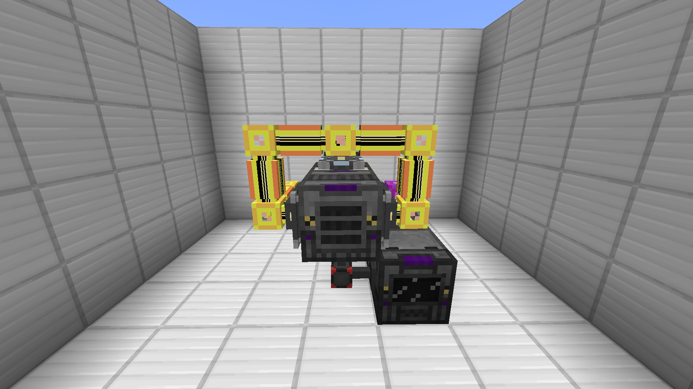
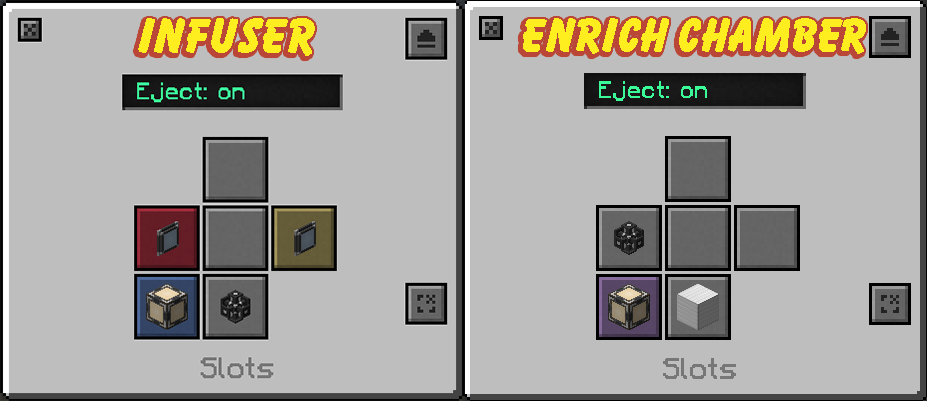
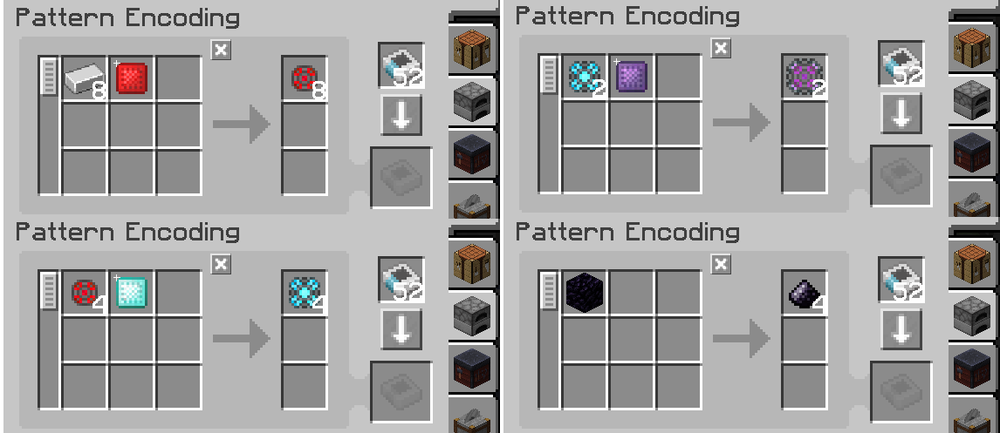

## AE2 Mekanism Infuser Auto-Crafting

Using **ME Pattern Providers**, we can fully automate the **Metallurgic Infuser** and **Enrichment Chamber**. This setup will only use 2 channels of your main network.

??? abstract "Materials"
	- [ ] 1x Metalluric Infuser (higher the level, the better)
	- [ ] 1x Enrichment Chamber (higher, the better)
	- [ ] 1x Quartz Fiber
	- [ ] 8x AE2 Cables
	- [ ] 2x ME Pattern Provider (Block form)
	- [ ] 1x ME Interface (Panel form)
	- [ ] 2x ME Storage Bus
	- [ ] 8x Blank Patterns
	
??? question "Do you have Refined Obsidian automated already?"
	You can skip the **Obsidian Dust** filter on the left storage bus and the **Refined Obsidian Dust Pattern** and instead make a processing pattern to turn **Refined Obsidian Ingots** into **Refined Obsidian Dust** and put that in a **Pattern Provider** connected to a **Crusher**.
---
### Building and Configuring

1. Put down your **Metallurgic Infuser** and place an **ME Storage Bus** on both sides of the infuser.
2. Place an **ME Pattern Provider** right behind the infuser and put an **ME Interface** on **top**, then place a **Quartz Fiber** on the side.
3. Place **7 AE2 cables** (Yellow in the example) connecting *all* AE2 devices. The orange cable connects to your main AE2 network.
{.center}

---

3. Adjacent to the **Infuser**, place an **Enrichment Chamber** and a **Pattern Provider** behind it and place a cable connecting **both** pattern providers.
{.center}
!!! warning "If you're using the same colored cables, place a **Cable Anchor** between them or use a different color."

=== "Same Colored Cables"

	{.center}

=== "Different Colored Cables"

	{.center}

---

5. Set the **Infuser** & **Enrichment**  inputs/outputs like the images below.
{.center width='500'}
!!! info "The **Infuser** will input items on the left (Red Slot) and Extra Items on the right (Yellow Slot) while the **Enrichment Chamber** will input/output the back (Purple)."
6. For the **ME Storage Buses** item filters have **Iron**, **Infused Alloy**, **Enriched Alloy**, and **Obsidian Dust** on the *left* side and **Enriched Redstone**, **Diamond**, and **Obsidian** on the *right*.
{.center width='650'}

---

### Processing Patterns

Now, we'll encode the **Processing Patterns**. These patterns are made so there will be a *(essentially)* 0% chance of clogging the Infuser due to leftover materials.
!!! danger "Make sure to set the patterns to **Process** (Furnace icon) instead of **Crafting** (Crafting Table icon)."

=== "Infuser Patterns"

	- 8 Iron + 1 Enriched Redstone = 8 Infused Alloy
	- 4 Infused Alloy + 1 Enriched Diamond = 4 Enriched Alloy
	- 2 Enriched Alloy + 1 Enriched Obsidian = 2 Atomic Alloy
	- 1 Obsidian = 4 Obsidian Dust
	{.center}

=== "Enrichment Chamber Patterns"
	
	- 1 Redstone = 1 Enriched Redstone
	- 1 Diamond = 1 Enriched Diamond
	- 1 Refined Obsidian Dust = 1 Enriched Obsidian
	- 8 Obsidian Dust + 1 Enriched Diamond = 8 Refined Obsidian Dust
	{.center}

---

Then you'll put patterns in each pattern provider as shown below.

{.center}

!!! warning "Make sure to give both machines power and to enabled `Auto-Split`."

---

## Fission Reactor Temp Calculation

**Big shoutout to Kayla for these equations! Go check out her [CC Mek SCADA on GitHub!](https://github.com/MikaylaFischler/cc-mek-scada/wiki)**

Use the equation below to estimate how hot your reactor will get at a specific burn rate for either water or sodium coolant. *Remember the reactor starts taking damage at >1200K!*

**Water**: `burn_rate(1)` \* 2 \* \[1,000,000 \* (`heat_capacity`-1)\] + 373.15
{.annotate}

1. in mB

**Sodium**: `burn_rate(1)` \* \[1,000,000 \* (`heat_capacity`-1)\] + 373.15
{.annotate}

1. in mB

???+ question "How do I calculate `heat_capacity`?"
	`heat_capacity` is joules per kelvin based on the physical size of the reactor, by default thats 1000x the amount of 'casing' which includes reactor glass, casing, valves, etc.
	
	\- Kayla

`heat_capacity` = (2 \* W2) + \[(H-2) \* (W2 -(W-2)2)\] \* 1000

!!! info "W and H are the Width and Height of Fission Reactor respectively"

[Full Explanation of Kayla's Calculations](https://github.com/MikaylaFischler/cc-mek-scada/wiki/Reactor-Temperature-Calculation)

---

> Mekanism | [CurseForge](https://legacy.curseforge.com/minecraft/mc-mods/mekanism)
