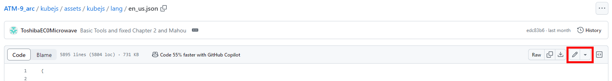

# All The Translations

## Important!

There is ***no*** set or forced timeline for translations. *Work on them at your own pace!* PR them however you want, either as whole chapters, sections of chapters, or even the whole thing if you want. **We are incredibly grateful for any contributions you make!**

Also, tell a staff member that you'd like to translate so they can give you access to the #translation-department, where you can ask questions and collaborate with other translators!

???+ warning "Important note for packs in development"
	If you are translating a pack that is under ***active development***, then you need to use the lang file from the **`dev` branch**, not `main`. The `dev` branch will always contain the most up-to-date quest lang file that you will translate.

???+ danger "Note regarding AI/Machine translations"
	We are **not** looking for AI/Machine translations.  We are looking for native speakers who are looking to put in the effort to make sure grammar is correct for readers of that language. We would've done it ourselves if we wanted a cheap attempt at quest translations.

---

## Getting Started

This guide will take you in chronological order from forking a repo, to committing, and then submitting a pull request.

### Requirements

- Know the language you want to translate *(duh)*
- A text editor ([Notepad++](https://notepad-plus-plus.org) is a great one)
- Have [Github Desktop](https://desktop.github.com/) or [Git Cli](https://cli.github.com/)
	- **GitHub Desktop is recommended for those not familiar with Git.**
    - For quick edits, you can open a codespace on your forked repo using [Github Web Editor](https://docs.github.com/en/codespaces/the-githubdev-web-based-editor#opening-the-githubdev-editor).
		- OR edit the lang file directly in your browser. [Explained below](#making-quick-edits).
		- OR you can simply download the translation key file then upload to your repository. [Explained below](#another-optional-way).

---

### Fork the Repository

Fork the modpack/mod you want to translate. 

- [ATM9/No Frills (NF's quests are the same as 9, just no Greg)](https://github.com/AllTheMods/ATM-9/fork)
- [ATM9 to the Sky](https://github.com/AllTheMods/All-the-mods-9-Sky/fork)
- [Gravitas 1](https://github.com/AllTheMods/tfc/fork)
- [Gravitas 2](https://github.com/AllTheMods/Gravitas2/fork)

[All The Mods GitHub](https://github.com/AllTheMods) for any modpack that isn't listed above.

---

### Clone `main` branch

This will **Clone** your fork from GitHub onto your computer.

???+ information "GitHub Desktop"
	Go to `File` -> `Clone repository...` OR do `Ctrl+Shift+o` and select your ATM Modpack fork.

	!!! info "I recommend putting the repository under `C:/Users/yourPCName` for easy access"

??? information "Git CLI"
	``` title="Change `USERNAME` to your GitHub name and `MODPACK` to the name of your fork"
	git clone https://github.com/USERNAME/MODPACK
	
	```
---

After cloning the repository go to where you cloned it on your computer and go to `packName/kubejs/assets/kubejs/lang` then copy and paste the `en_us.json` file into the same spot.

Rename the copied `en_us.json` to the language code of the lanuage you want to translate. All language codes can be found below or [here](http://www.lingoes.net/en/translator/langcode.htm).

#### Language Codes

??? abstract "Language Codes (Ctrl+F to find language)"
	| Code | Language |
	|----- | -------- |
	|af_ZA | Afrikaans (South Africa) | 
	|ar_AE | Arabic (U.A.E.) | 
	|ar_BH | Arabic (Bahrain) | 
	| ar_DZ | Arabic (Algeria) | 
	| ar_EG | Arabic (Egypt) | 
	| ar_IQ | Arabic (Iraq) | 
	| ar_JO | Arabic (Jordan) | 
	| ar_KW | Arabic (Kuwait) | 
	| ar_LB | Arabic (Lebanon) | 
	| ar_LY | Arabic (Libya) | 
	| ar_MA | Arabic (Morocco) | 
	| ar_OM | Arabic (Oman) | 
	| ar_QA | Arabic (Qatar) | 
	| ar_SA | Arabic (Saudi Arabia) | 
	| ar_SY | Arabic (Syria) | 
	| ar_TN | Arabic (Tunisia) | 
	| ar_YE | Arabic (Yemen) | 
	| az_AZ | Azeri (Latin) |  (Azerbaijan) | 
	| az_AZ | Azeri (Cyrillic) |  (Azerbaijan) | 
	| be_BY | Belarusian (Belarus) | 
	| bg_BG | Bulgarian (Bulgaria) | 
	| bs_BA | Bosnian (Bosnia and Herzegovina) | 
	| ca_ES | Catalan (Spain) | 
	| cs_CZ | Czech (Czech Republic) | 
	| cy_GB | Welsh (United Kingdom) | 
	| da_DK | Danish (Denmark) | 
	| de_AT | German (Austria) | 
	| de_CH | German (Switzerland) | 
	| de_DE | German (Germany) | 
	| de_LI | German (Liechtenstein) | 
	| de_LU | German (Luxembourg) | 
	| dv_MV | Divehi (Maldives) | 
	| el_GR | Greek (Greece) | 
	| en_AU | English (Australia) | 
	| en_BZ | English (Belize) | 
	| en_CA | English (Canada) | 
	| en_CB | English (Caribbean) | 
	| en_GB | English (United Kingdom) | 
	| en_IE | English (Ireland) | 
	| en_JM | English (Jamaica) | 
	| en_NZ | English (New Zealand) | 
	| en_PH | English (Republic of the Philippines) | 
	| en_TT | English (Trinidad and Tobago) | 
	| en_US | English (United States) | 
	| en_ZA | English (South Africa) | 
	| en_ZW | English (Zimbabwe) | 
	| es_AR | Spanish (Argentina) | 
	| es_BO | Spanish (Bolivia) | 
	| es_CL | Spanish (Chile) | 
	| es_CO | Spanish (Colombia) | 
	| es_CR | Spanish (Costa Rica) | 
	| es_DO | Spanish (Dominican Republic) | 
	| es_EC | Spanish (Ecuador) | 
	| es_ES | Spanish (Castilian) | 
	| es_ES | Spanish (Spain) | 
	| es_GT | Spanish (Guatemala) | 
	| es_HN | Spanish (Honduras) | 
	| es_MX | Spanish (Mexico) | 
	| es_NI | Spanish (Nicaragua) | 
	| es_PA | Spanish (Panama) | 
	| es_PE | Spanish (Peru) | 
	| es_PR | Spanish (Puerto Rico) | 
	| es_PY | Spanish (Paraguay) | 
	| es_SV | Spanish (El Salvador) | 
	| es_UY | Spanish (Uruguay) | 
	| es_VE | Spanish (Venezuela) | 
	| et_EE | Estonian (Estonia) | 
	| eu_ES | Basque (Spain) | 
	| fa_IR | Farsi (Iran) | 
	| fi_FI | Finnish (Finland) | 
	| fo_FO | Faroese (Faroe Islands) | 
	| fr_BE | French (Belgium) | 
	| fr_CA | French (Canada) | 
	| fr_CH | French (Switzerland) | 
	| fr_FR | French (France) | 
	| fr_LU | French (Luxembourg) | 
	| fr_MC | French (Principality of Monaco) | 
	| gl_ES | Galician (Spain) | 
	| gu_IN | Gujarati (India) | 
	| he_IL | Hebrew (Israel) | 
	| hi_IN | Hindi (India) | 
	| hr_BA | Croatian (Bosnia and Herzegovina) | 
	| hr_HR | Croatian (Croatia) | 
	| hu_HU | Hungarian (Hungary) | 
	| hy_AM | Armenian (Armenia) | 
	| id_ID | Indonesian (Indonesia) | 
	| is_IS | Icelandic (Iceland) | 
	| it_CH | Italian (Switzerland) | 
	| it_IT | Italian (Italy) | 
	| ja_JP | Japanese (Japan) | 
	| ka_GE | Georgian (Georgia) | 
	| kk_KZ | Kazakh (Kazakhstan) | 
	| kn_IN | Kannada (India) | 
	| ko_KR | Korean (Korea) | 
	| kok_IN | Konkani (India) | 
	| ky_KG | Kyrgyz (Kyrgyzstan) | 
	| lt_LT | Lithuanian (Lithuania) | 
	| lv_LV | Latvian (Latvia) | 
	| mi_NZ | Maori (New Zealand) | 
	| mk_MK | FYRO Macedonian (Former Yugoslav Republic of Macedonia) | 
	| mn_MN | Mongolian (Mongolia) | 
	| mr_IN | Marathi (India) | 
	| ms_BN | Malay (Brunei Darussalam) | 
	| ms_MY | Malay (Malaysia) | 
	| mt_MT | Maltese (Malta) | 
	| nb_NO | Norwegian (Bokm?l) (Norway) | 
	| nl_BE | Dutch (Belgium) | 
	| nl_NL | Dutch (Netherlands) | 
	| nn_NO | Norwegian (Nynorsk) (Norway) | 
	| ns_ZA | Northern Sotho (South Africa) | 
	| pa_IN | Punjabi (India) | 
	| pl_PL | Polish (Poland) | 
	| ps_AR | Pashto (Afghanistan) | 
	| pt_BR | Portuguese (Brazil) | 
	| pt_PT | Portuguese (Portugal) | 
	| qu_BO | Quechua (Bolivia) | 
	| qu_EC | Quechua (Ecuador) | 
	| qu_PE | Quechua (Peru) | 
	| ro_RO | Romanian (Romania) | 
	| ru_RU | Russian (Russia) | 
	| sa_IN | Sanskrit (India) | 
	| se_FI | Sami (Northern) (Finland) | 
	| se_FI | Sami (Skolt) (Finland) | 
	| se_FI | Sami (Inari) (Finland) | 
	| se_NO | Sami (Northern) (Norway) | 
	| se_NO | Sami (Lule) (Norway) | 
	| se_NO | Sami (Southern) (Norway) | 
	| se_SE | Sami (Northern) (Sweden) | 
	| se_SE | Sami (Lule) (Sweden) | 
	| se_SE | Sami (Southern) (Sweden) | 
	| sk_SK | Slovak (Slovakia) | 
	| sl_SI | Slovenian (Slovenia) | 
	| sq_AL | Albanian (Albania) | 
	| sr_BA | Serbian (Latin) (Bosnia and Herzegovina) | 
	| sr_BA | Serbian (Cyrillic) (Bosnia and Herzegovina) | 
	| sr_SP | Serbian (Latin) (Serbia and Montenegro) | 
	| sr_SP | Serbian (Cyrillic) (Serbia and Montenegro) | 
	| sv_FI | Swedish (Finland) | 
	| sv_SE | Swedish (Sweden) | 
	| sw_KE | Swahili (Kenya) | 
	| syr_SY | Syriac (Syria) | 
	| ta_IN | Tamil (India) | 
	| te_IN | Telugu (India) | 
	| th_TH | Thai (Thailand) | 
	| tl_PH | Tagalog (Philippines) | 
	| tn_ZA | Tswana (South Africa) | 
	| tr_TR | Turkish (Turkey) | 
	| tt_RU | Tatar (Russia) | 
	| uk_UA | Ukrainian (Ukraine) | 
	| ur_PK | Urdu (Islamic Republic of Pakistan) | 
	| uz_UZ | Uzbek (Latin) (Uzbekistan) | 
	| uz_UZ | Uzbek (Cyrillic) (Uzbekistan) | 
	| vi_VN | Vietnamese (Viet Nam) | 
	| xh_ZA | Xhosa (South Africa) | 
	| zh_CN | Chinese (S) | 
	| zh_HK | Chinese (Hong Kong) | 
	| zh_MO | Chinese (Macau) | 
	| zh_SG | Chinese (Singapore) | 
	| zh_TW | Chinese (T) | 
	| zu_ZA | Zulu (South Africa) | 

---

#### Another Optional Way

Instead of copying the entire repo onto your computer, you can also download only the lang file for the respective pack and translate it. 

Download the `en_us.json` lang file from the respective pack, the links below are the most up-to-date files the translations are to be based off of.

- [ATM9/No Frills](https://github.com/AllTheMods/ATM-9/blob/main/kubejs/assets/kubejs/lang/en_us.json)
- [ATM9 to the Sky](https://github.com/AllTheMods/All-the-mods-9-Sky/blob/dev/kubejs/assets/kubejs/lang/en_us.json)
- [Gravitas 1](https://github.com/AllTheMods/tfc/blob/main/kubejs/assets/kubejs/lang/en_us.json)
- [Gravitas 2](https://github.com/AllTheMods/Gravitas2/blob/main/kubejs/assets/gravitas/lang/en_us.json)

For all other packs, the lang file will be under `packName/kubejs/assets/kubejs/lang/en_us.json` in their [respective repositories](https://github.com/AllTheMods).

???+ warning "Important"
	As state in the beginning, if you are translating a pack that is in active development, then you need to use the same file path as above but for the **`dev` branch**.

---

## How ATM Quests Work

Before you get to translating you'll want to know how ATM quests work. ATM Quests use a **key:value** system to make quest creation and translation efforts easier. It works by assigning a value (ex: a quest description) to a key (ex: a specific quest).

!!! example "For example `atm9.quest.mekanism.desc.basicAlloy` would point to the quest to make Mekanism Alloy."

???+ information "The format for quests are as follows:"
	`packName.quest/chapterTitle.chapterName.description/title/subtitle.nameOfQuest`

ATM quests also use [Minecraft Formatting Codes](https://minecraft.wiki/w/Formatting_codes) for colored text, so make sure you put those color codes back in after translating!

You will also see `//n` which puts the text on a new line, so be sure to put those back in their proper places also.

???+ tip
	You can view your translations as you do them by doing `/refresh` to view changes in-game. Make sure to change Minecraft's language to view it.

---

## Commit (Updating)

Once you're _committed_ to your translations, you can then **Commit** them, then make a **Pull Request** against both `main` branches / repositories.

### Committing Changes

Depending on current setup, you may have an editor (_Visual Studio Code_), that has **Git** integration. You're free to use this, Github Desktop, or Git.

???+ information "Making a commit with GitHub Desktop"
	1. Fill out the **`Summary`** and **`Description`** on the bottom left
	2. Click **`Commit to main`** when you're ready to commit.
	
	If you made a mistake, you can undo the commit in the bottom left. Otherwise click **`Push origin`** to push the commit to GitHub.

???+ Information "If you downloaded just the lang file"
	1. Go to your repository on the website and go to same spot you downloaded the `en_us.json` lang file from.
	2. Click **`Add file`** in the top right and click **`Upload files`**
	3. Upload your translated lang file and click **`Commit changes`**

??? Information "Making a commit with Git"
    Add files to Commit.
    ```
    git commit .
    ```

    Add a message to your Commit. We recommend being more descriptive about your Commit(s).
    ```
    git commit -m "update"
    ```

    Push changes
    ```
    git push
    ```

---

## Pull Request

When submitting a PR (Pull Request), you're requesting us to **Pull** translations from your Repository (Fork) to be approve & merged into the official pack. This is done in browser by going to the modpack's repository and creating a PR from your `main` branch to ours.

---

## Making Quick Edits

!!! warning "This requires you to have committed your lang file at least once."

Instead of going through the above process again to do a small correction or addition, you can do an edit directly in your browser!

**1.** Go to your fork of the pack you are translating and navigate to `kubejs/assets/kubejs/lang` and click on your lang file.

**2.** Click the little edit button in the top-right under the `History` button.


**3.** After you are done with your edits, click `Commit changes...` and fill out what changes you made, then click `Commit changes`

**4.** Now when you go to the "homepage" of your fork, there should be a yellow banner that has a `Compare & pull request` button. That will be how you make a PR for your quick edit.


---

## More Resources

Most of everything you need to know is explained in this guide, however if you have questions or concerns feel free to ask in the #translation-department!

- [ToshibaMicrowave's FTBQuests Tutorials](https://www.youtube.com/playlist?list=PLi-eopKJxIIg1K3sAlxwHLwFixLE20ezZ)
	- This playlist contains short tutorials covering [FTB Quests](https://legacy.curseforge.com/minecraft/mc-mods/ftb-quests-forge)
- [List of Translators](https://discord.com/channels/254530689225981953/1240295487509368872/1251896531544571945)
	- List of languages and their translators. You need access to the **#translation-department** to view the [Discord](https://discord.com/invite/allthemods) message.
- [List of Language Codes](http://www.lingoes.net/en/translator/langcode.htm)
	- Browser may give you a warning since the site is in `http` and not `https`.
- [Minecraft Formatting Codes](https://minecraft.wiki/w/Formatting_codes)
	- Instead of using `§`, you will use `&` for all color codes within the quests.

---

> All The Mods | [GitHub](https://github.com/AllTheMods) | [Discord](https://discord.com/invite/allthemods)
