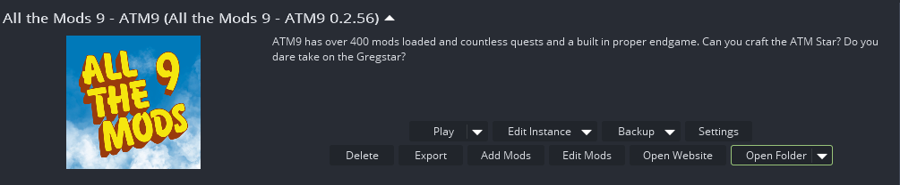

# Backups

## What should I backup?

1. **options.txt**
	- This contains most menu, volume, and video settings.
2. **keys.txt**
	- This contains all your keybinds.
3. **Any configs you changed inside** `packInstall/configs`
???+ danger "DON'T copy and paste the entire configs folder"
	Only backup the config files that you have *changed*. Copying the entire folder can corrupt your install if the configs are from a different pack version.
4. **A backup of your world(s)**
	- See [below.](#restoring-a-world-backup)
5. **Journeymap Waypoints (optional)**
	- These are located in `packinstall/journeymap/data/sp`. Copy the folder with the world you want to backup.

## Restoring a World Backup 

**SimpleBackups** is a mod included in the client version of ATM, but *NOT* included in the server version of ATM. You must add it yourself or use your server host's built-in options. 

By default, it will save to `packInstall/simplebackups` with a zip file with your world's name. You can configure how often it does a backup at `/configs/simplebackups-common.toml`. **Default Interval**: Every 2 hours (120 minutes).

### ATLauncher

1. Close out of your modpack.
2. Click `Open Folder` and open the `simplebackups` folder.

3. **Copy** the zip file of the backup you want to restore **to your** `saves` **folder**.
4. Go to your `saves` folder and **delete** the world you want to restore
5. Open the zip file, then **drag** the folder inside, out to your `saves` folder. **Delete** the zip file
!!! failure "If the restore was unsuccessful, you may need to try an older backup before the issue occurred"

### CurseForge

1. **Close** completely out of the modpack. 
2. **Right-click** on the ATM icon in your CurseForge modpack screen and click `Open Folder`

---
3. **Open** `simplebackups`

4. **Open** the zip file that you want to restore. (They're labeled by the date created; the latest one is recommended.)
5. **Copy (Ctrl + C)** the folder inside, then return to your `saves` folder.
6. Back up your old world and **delete** it from this folder
7. **Paste (Ctrl + V)** the backup into `saves`
!!! failure "If the restore was unsuccessful, you may need to try an older backup before the issue occurred"

> Simplebackups | [CurseForge](https://legacy.curseforge.com/minecraft/mc-mods/simple-backups)
