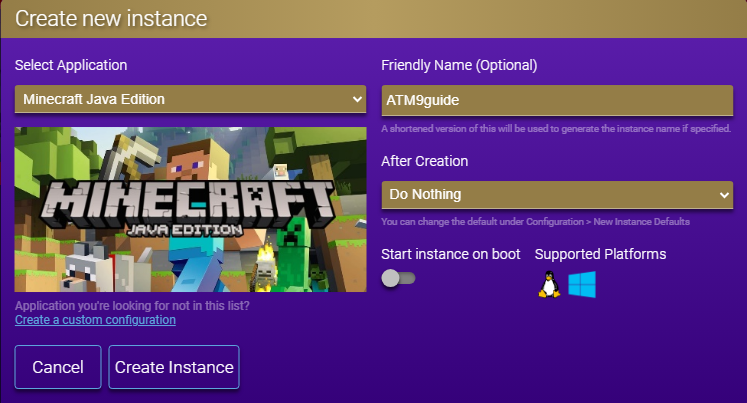
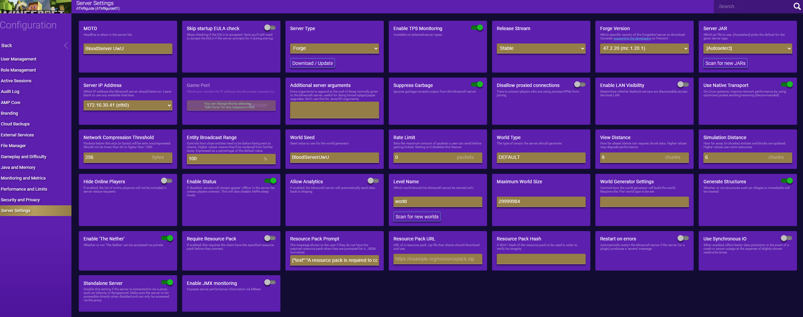
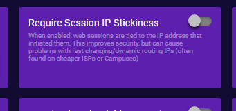
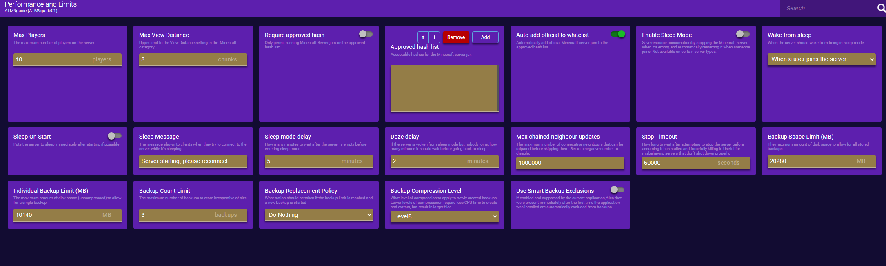
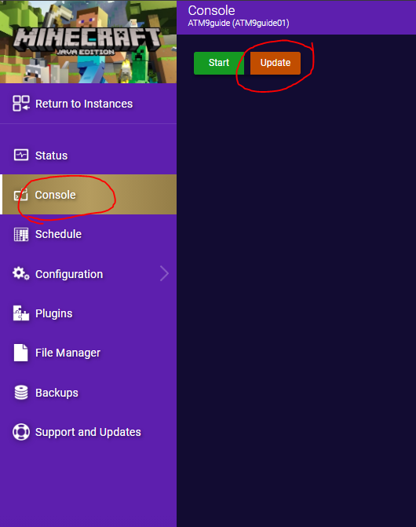
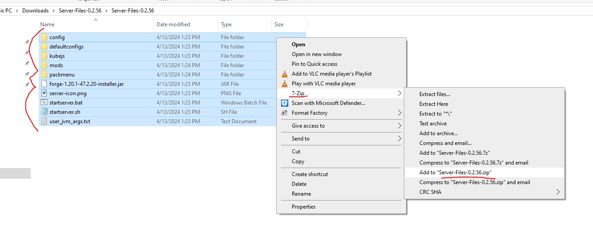
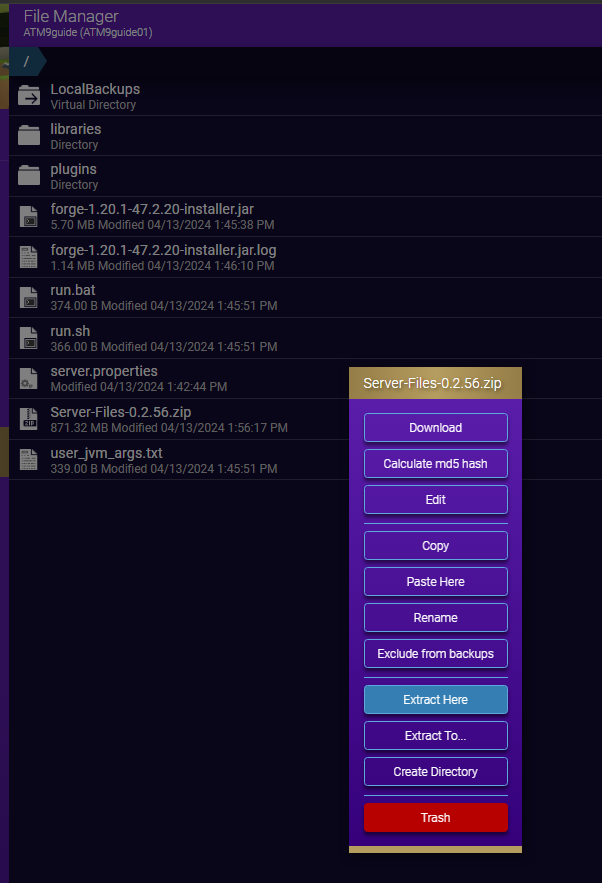
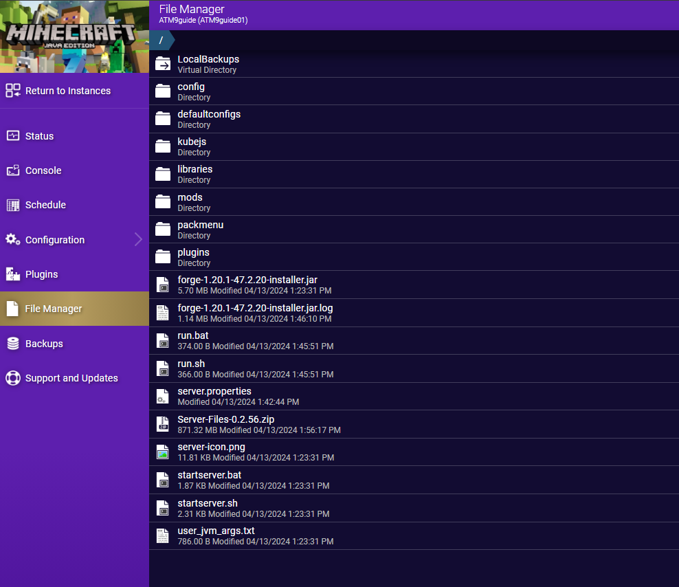

???+ warning
	This guide is outdated as of `6/1/24`. Guide will be updated to AMP's new UI.

## AMP Install Guide

This is a guide for installing ATM9 (and possibly other packs) on CubeCoderz's AMP gameserver hosting software!

???+ info 
	The current version of AMP as of the creation of this guide is **2.5.0.4**. As the software is updated, the exact location of settings may change.

???+ warning
	This guide is currently hosted by the official ATM website/Discord. If found anywhere else please advise them to delete it and instead link to this [official version](https://allthemods.github.io/alltheguides/help/server/).

???+ note "This guide assumes:"
	- You have fully installed the AMP software and have successfully gained access to the web based GUI. If you need help installing the base software please refer to the [CubeCoderz Documentation](https://github.com/CubeCoders/AMP/wiki).
	- You have already downloaded the latest version of the [ATM Pack ServerFiles](https://github.com/AllTheMods) and have unzipped them into a folder.

---

### Creating a New Instance.


- Under **Select Application**, choose **Minecraft Java Edition**.
- Under **Friendly Name**, pick a name to reference the server such as **ATM9**.
- Under **After Creation**, pick **Do Nothing**.
???+ note
	If you do not want the instance to start every time AMP is started, uncheck the **Start Instance on Boot** option. This is **on** by default.
- Select **Create Instance**



---

### Configuring Server Settings

- Choose **Manage** from the newly created instance


- On the left menu, select **Configuration** and then **Server Settings**


Change the following:

- **Server type**: `Forge`
- **Forge Version**: Change to current Forge version. 
	- For this example the current version is `47.2.20`.
- **View Distance**: `8`
- **Simulation Distance**: `6`
- **Use Synchronous IO**: `off`



---

- On the left menu, select **Security and Privacy**

Change the following:

- **Require Session IP Stickiness**: `off`



---

- On the left menu, select **Performance and Limits**

Change the following:

- **Max View Distance**: `8`
- **Enable Sleep Mode**: `off`
- **Stop Timeout**: `60000`
- **Backup Count Limit**: `3`



---

On the left menu, select **Monitoring and Metrics**

Change the following:

- **Console Scrollback Period**: `120`


---

On the left menu, select **Java and Memory**

Change the following:

- **Memory Limit (MB)**: Min: `6144`. Max: `16384` 
!!! warning "Anything over `16384` requires changing the GC settings and is beyond the scope of this guide."
- **Additional java options**: Paste in the server java arguments from the `user_jvm.txt` without the first two lines `xmx` or `xms`

!!! example ""
	```-XX:+UseG1GC -XX:+ParallelRefProcEnabled -XX:MaxGCPauseMillis=200 -XX:+UnlockExperimentalVMOptions -XX:+DisableExplicitGC -XX:+AlwaysPreTouch -XX:G1NewSizePercent=30 -XX:G1MaxNewSizePercent=40 -XX:G1HeapRegionSize=8M -XX:G1ReservePercent=20 -XX:G1HeapWastePercent=5 -XX:G1MixedGCCountTarget=4 -XX:InitiatingHeapOccupancyPercent=15 -XX:G1MixedGCLiveThresholdPercent=90 -XX:G1RSetUpdatingPauseTimePercent=5 -XX:SurvivorRatio=32 -XX:+PerfDisableSharedMem -XX:MaxTenuringThreshold=1```

- **Java Version**: `Java 17`
???+ note
	If `Java 17` is not in the dropdown list, you need to close AMP completely, install `Java 17` to the server, then restart AMP.


---

On the left menu, select **Gameplay and Difficulty**

Change the following:

- **Op permission level**: `3:Kick/ban/op players`
	- This is changed to keep OP users from running spark report from in-game. Spark reports should only be done from the server console directly.
- **Spawn Protection Radius**: `1`
- **Allow PvP**: `on`
- **Allow Flight**: `on`
- **Allow Command Blocks**: `on`
- **Player idle timeout**: `0` 
	- Can be done via mods instead or you can change this setting to your preference, but can lead to 'ghost players' on occasion stuck in the AMP menus as showing online after they have been kicked.
- **Use Whitelist**: Don't change from default `off` 
	- Highly recommended to use this feature, but only after the server is successfully running
- **Max tick Time**: `-1`


---

### Installing Server Forge

Click the **Back** arrow at the top of the left menu


Select **Console** from the left menu and then click **Update** from the middle screen.



Wait while the server downloads and installs the selected forge version. 

!!! note "This can take several minutes depending on your server specs and internet connection"

When it finishes it should say **The server installed successfully**; if it does not please doublecheck the above settings and verify you have selected the appropriate Forge Version.


---

### Importing the Server Files

On the left menu, select **File Manager**

The easiest way to import the server files is to unzip the files and create a new zip

- To remove the double-wrapping (zipping a folder instead of a group of files) of the files: 
	- **Extract** the serverfiles you downloaded from CurseForge into a folder. 
	- Go into the folder inside that folder and then select **all the files** and re-zip. 
	
I recommend using **7zip** as this is what I have used for testing
!!! warning "Make sure you save as .zip and not .7z"



---

Drag the newly created zip file into the **File Manager window**. Once it finishes you may need to refresh the page to see the file in the file list.


---

Right click the .zip file in the list and chose **Extract Here**. 

!!! info "This may take several minutes depending on your server specs and storage speed."

Once it finishes you may need to **refresh** the page to see the newly extracted files populated in the list.


{align=right}

---

### Starting the Server

Select **Console** from the left menu and click **Start**.


- Accept the EULA that pops up


---

The server will now start. This can take several minutes depending on your server specs and storage speed. 

???+ note
	Errors are normal and to be expected as long as it continues loading. Be patient as the first startup usually takes time while it creates all the needed files, configs, folders, etc. 
	
You will know it is finished when the notification window in the bottom right disappears and the server says **Dedicated server took XXX.XX seconds to load**.


---

It is recommended after the first startup to stop the server, using the red **Stop** button at the top, and then start it again.

- Try to connect to the server and verify operation
- If you need to add server admin mods you would place them into the **mods** folder under **File Manager** while the server is ***stopped***; you can edit files directly from within the file manager in AMP for making changes to the txt config files. 
!!! danger "Only edit, add, or remove files WHILE THE SERVER IS STOPPED!"

### Changing Server Properties

All settings within `server.properties` are in independent tabs in the various settings in AMP and it is recreated every server startup. 

!!! warning "CHANGES TO `server.properties` FILE WILL NEVER SAVE!"

???+ example "Changing Server Type"
	If you need to edit the world type for example, to run a **Skyblock** server, you would change it under `Configuration > Server Settings > World Type`.

> All The Mods | [GitHub](https://github.com/AllTheMods) | [Discord](https://discord.com/invite/allthemods) | [CubeCoders: AMP](https://cubecoders.com/AMP)
