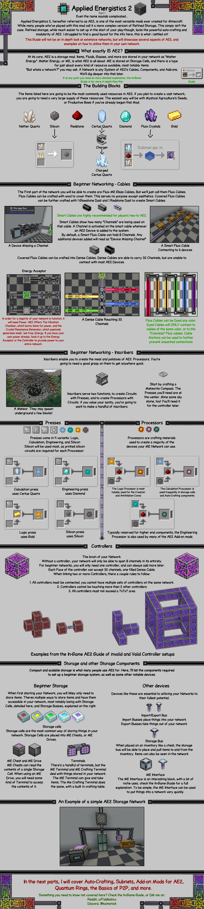
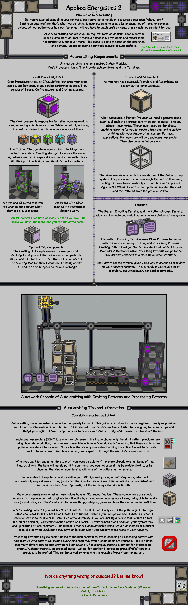
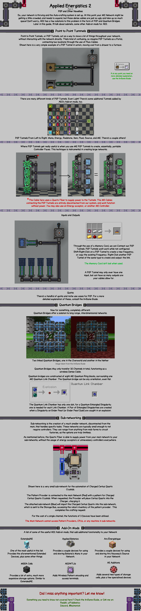

# Applied Energistics 2
{.center}
## Description
???+ Quote "Curseforge Description"

    === " "
        ``` markdown
        Applied Energistics 2 (AE2) is a comprehensive mod for Minecraft that introduces a unique approach to in-game inventory management. It presents a tech-based, futuristic theme, centered around the concept of using energy and technology to convert matter into energy and vice versa. 
        ```

## Applied Energistics 2 Guides
!!! Info "Click on the image to zoom in!"
=== "Part 1: The Basics"
	
	{.center}

=== "Part 2: Intro to Autocrafting"
	
	{.center}

=== "Part 3: P2P & Other Novelties"
	
	{.center}

---

<!--- [Applied Energistics 2 Guide](../guides/kaimonickguides.md#applied-energistics-2) --->

> CurseForge: [Applied Energistics 2](https://www.curseforge.com/minecraft/mc-mods/applied-energistics-2) | Project Wakerife - [GitHub](https://github.com/Pundah) | Project Wakerife - [Discord](https://discord.gg/M4HQTQ9g9f)