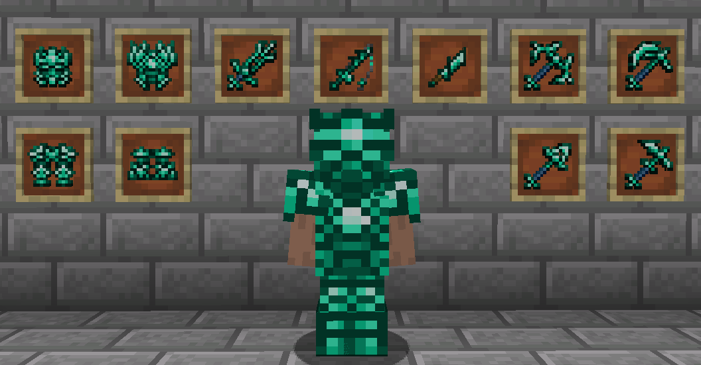
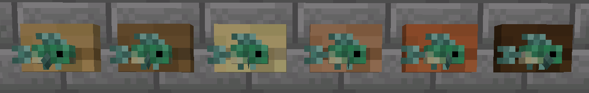

# Aquaculture 2
{.center}
{.center}
## Description
???+ Quote "Curseforge Description"

    === " "
        ``` markdown
        Aquaculture 2 expands the fishing system in Minecraft with over 30 new fish to catch either with a rod (any modded or vanilla rod will work!) or found swimming in the wild. It also adds a series of new rods which allows you to equip hooks & bait for additional functionality. Customized fishing Line & bobbers are also available to make your fishing rod truly unique. Modifiers & customization items can be applied in the Tackle Box, which also allows you to store additional hooks, bait, line & bobbers.
        
        Each biome type - even modded biomes - have new types of fish that'll spruce up your fishing experience and your world with fish mobs swimming around in rivers, ponds and the ocean! The fish caught can be turned into fish fillets, the amount of fish fillets will depend on the fish (Or weight, if the config option is enabled). Furthermore, you can get shiny new loot while fishing! (Including the fabled Neptunium tools or armor! (Configurable))
        ```
## Enchantments
!!! Info "Modpack Enchantments"

    === " "

        ``` markdown
        * Appealing - Catch more fish.
        * Magnetic - Catch more loot.
        * Longcast - Fishing Rod casts farther.
        * Shortcast - Fishing Rod casts closer.
        * Double Hook - Chance to catch two fish instead of one.
        * Barbed Hook - Catch window is longer.
        * Heavy Line - Higher chance to catch higher weight.
        ```
> CurseForge: [Aquaculture 2](https://www.curseforge.com/minecraft/mc-mods/aquaculture) | Project Wakerife - [GitHub](https://github.com/Pundah) | Project Wakerife - [Discord](https://discord.gg/M4HQTQ9g9f)