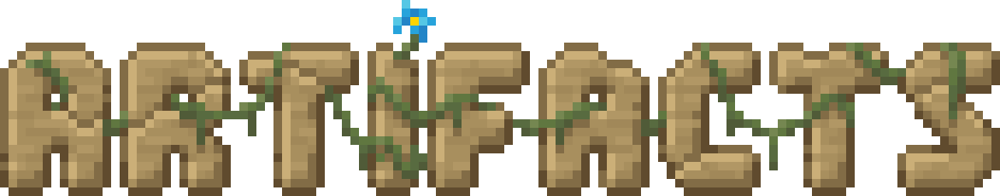
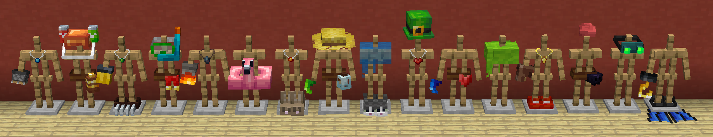

# Artifacts
{.center}
{.center}
## Description
???+ Quote "Curseforge Description"

    === " "
        ``` markdown
        Artifacts is a mod which aims to make exploration more rewarding by adding various powerful items that cannot be crafted.

        The items added by this mod can be found in chests in vanilla structures, through archaeology, or can very rarely be found worn by entities. All artifacts only have a few locations in which they can be found, so go out and explore! Additionally, a new underground campsite structure has been added. Mimics occasionally spawn in these campsites instead of a chests, which are dangerous enemies that attack players that get too close. Mimics always drop a random artifact when killed.

        Every item added by this mod has a unique model when equipped. An up-to-date list of items and where they can be found is available on the wiki on GitHub.
        ```
> CurseForge: [Artifacts](https://www.curseforge.com/minecraft/mc-mods/artifacts) | Project Wakerife - [GitHub](https://github.com/Pundah) | Project Wakerife - [Discord](https://discord.gg/M4HQTQ9g9f)