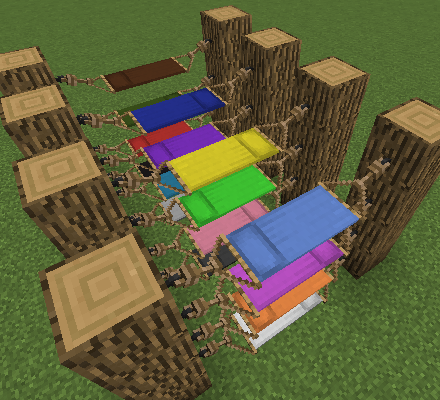

# Comforts
{.center}
## Description
???+ Quote "Curseforge Description"

    === " "
        ``` markdown
        Comforts is a mod that adds sleeping bags and hammocks to Minecraft. These items can be used just like beds except they do not set a player's spawn point on use, safely preserving a player's spawn point at their home base. Just like beds, they also come in 16 different colors! The difference is that sleeping bags can be stacked and are more convenient to use on adventures and hammocks are like an inverse bed, turning day to night.
        ```

## Configuration Options
!!! Info "Modpack Config Options"

    === " "

        ``` markdown
        * Auto-Use Sleeping Bag.
        * Well-Rested Mechanic.
        * Sleepiness Factor.
        * Hammocks at Night.
        * Sleeping Bag Break Chance.
        * Sleeping Bag Debuffs.
        * Insulated Sleeping Bags.
        ```

> CurseForge: [Comforts]([link](https://www.curseforge.com/minecraft/mc-mods/comforts)) | Project Wakerife - [GitHub](https://github.com/Pundah) | Project Wakerife - [Discord](https://discord.gg/M4HQTQ9g9f)