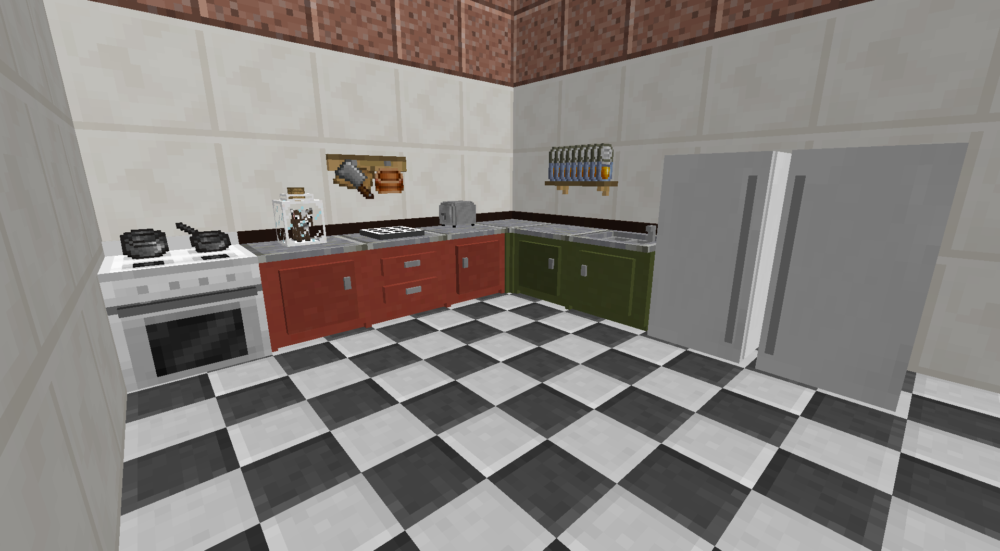

# Cooking for Blockheads
{.center}
## Description
???+ Quote "Curseforge Description"

    === " "
        ``` markdown
        This mod adds a cooking book along with a functional kitchen to Minecraft. Use the book or the Cooking Table to find out what you can cook with what ingredients you currently have available, and start cooking immediately through a single click.

        The kitchen is modular and can be upgraded through additional blocks, allowing for expanded storage, infinite water for crafting provided by the sink, or efficient and delicious cooking with the oven. Some people even went as far as capturing a cow in a jar to provide them with infinite milk!
        ```
> CurseForge: [Cooking for Blockheads](https://www.curseforge.com/minecraft/mc-mods/cooking-for-blockheads) | Project Wakerife - [GitHub](https://github.com/Pundah) | Project Wakerife - [Discord](https://discord.gg/M4HQTQ9g9f)