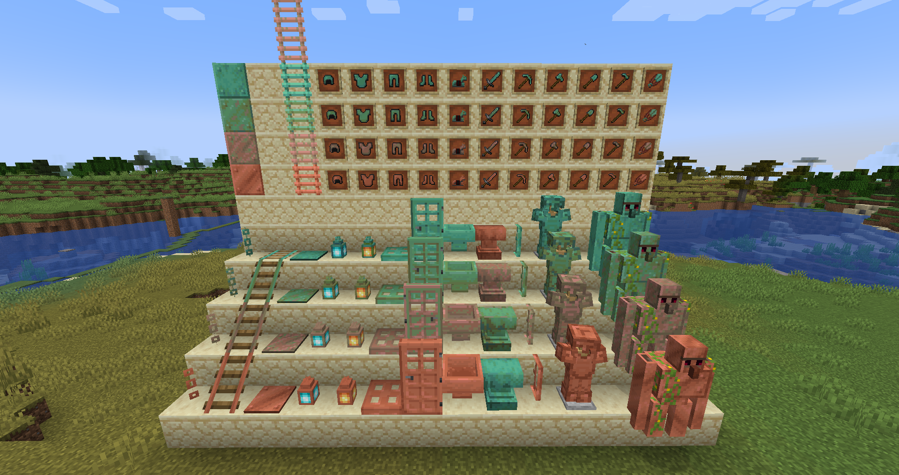

# Everything is Copper
{.center}
## Description
???+ Quote "Curseforge Description"

    === " "
        ``` markdown
        Adds lots of stuff made of copper to offset the imbalance between iron and copper in 1.18+
        Everything weathers and come in 4 variants, unaffected, exposed, weathered and oxidized.
        If you still have copper left over, start eating it.
        ```

> CurseForge: [Everything is Copper](https://www.curseforge.com/minecraft/mc-mods/everythingcopper) | Project Wakerife - [GitHub](https://github.com/Pundah) | Project Wakerife - [Discord](https://discord.gg/M4HQTQ9g9f)