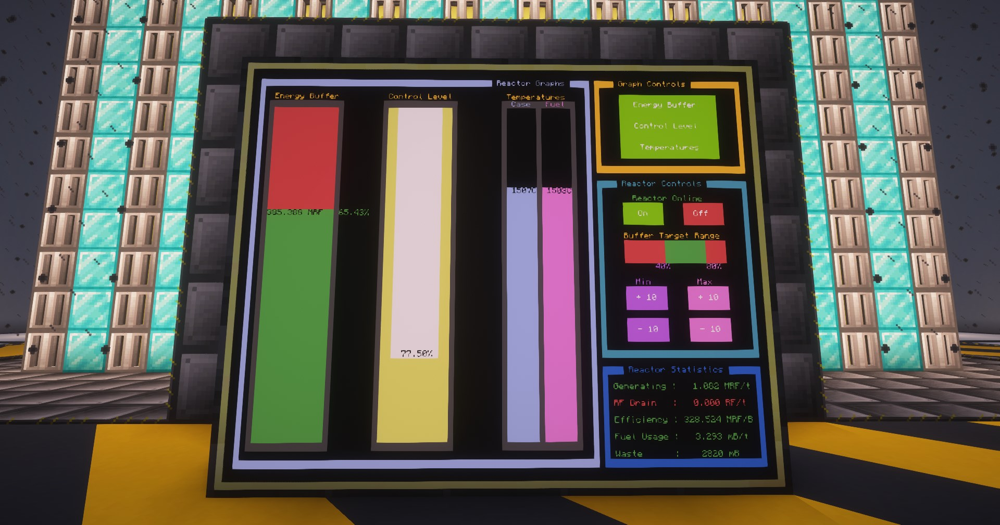

### Moderators

| Moderator | FE/t 	| % of top  | μB/t 	|
| --------- | ---- 	| --------  | ---- 	|
| Air 		| 13,406 | 91.23% 	| 198 	|
| Dry Ice 	| 13,525 | 92.06% 	| 198 	|
| Iron 		| 13,862 | 94.34% 	| 190 	|
| Manasteel | 13,912 | 94.68% 	| 191 	|
| Lead 		| 14,277 | 97.16% 	| 187 	|
| Graphite 	| 14,342 | 97.60% 	| 182 	|
| Tangerium | 14,422 | 98.15% 	| 184 	|
| Electrum 	| 14,466 | 98.45% 	| 187 	|
| Emerald 	| 14,475 | 98.51% 	| 184 	|
| Cryomisi	| 14,502 | 98.69% 	| 186 	|
| Elementium| 14,527 | 98.86% 	| 185 	|
| Diamond 	| 14,573 | 99.18% 	| 184 	|
| Terrasteel| 14,625 | 99.53% 	| 185 	|
| Netherite	| 14,629 | 99.56% 	| 183 	|
| Redfrigium| 14,694 | 100.00%	| 181 	|
--->
---

### Computer Craft Integration

You can use **Computer Craft** with scripts such as [Kasra-G's Automated Reactor Controller](https://github.com/Kasra-G/ReactorController) to easily automate your reactor with the **Reactor Computer Port**. There are other Computer Craft scripts that will integrate with Extreme Reactor Turbines as well. 

??? Note "You must enable HTTP API for Computer Craft Integration"
    To pull the script above as outlined in the repo's instructions, you must edit the following file:<br>
    `/YOURWORLDNAME/defaultconfigs/computercraft-server.toml`

    Search for `http` and make sure it is set to `enabled = true` as shown below.
    ``` toml title="computercraft-server.toml"
        [http]
            #Enable the "http" API on Computers. Disabling this also disables the "pastebin" and
            #"wget" programs, that many users rely on. It's recommended to leave this on and use
            #the "rules" config option to impose more fine-grained control.
            enabled = true
    ```

    Your server *must* be **off** when changing this file. If you edit it while it is running, the changes will not apply.



---

>  CurseForge: [Extreme Reactors](https://legacy.curseforge.com/minecraft/mc-mods/extreme-reactors) | Project Wakerife - [GitHub](https://github.com/Pundah) | Project Wakerife - [Discord](https://discord.gg/M4HQTQ9g9f)