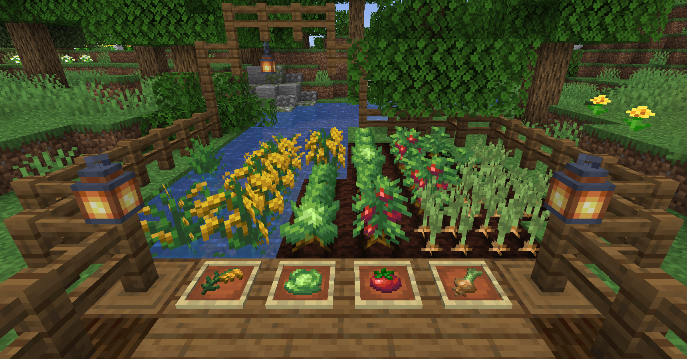

# Farmer's Delight
{.center}
{.center}
## Description
???+ Quote "Curseforge Description"

    === " "
        ``` markdown
        Farmer's Delight is a mod that gently expands upon farming and cooking in Minecraft.

        Using a simple cooking system and a few familiar ingredients, you'll be able to prepare a wide variety of hearty meals: from sandwiches to salads and stews, from beautiful desserts to mouth-watering feasts, no ingredient will be left behind in your kitchen!

        It also introduces a rich set of utilities: a way to improve the very soil your crops grow in, a brand new kind of tool to scavenge resources with, cute decorations for your builds, and many blocks and items to help you on your adventure!

        It's time to farm a little bit of everything!
        ```
> CurseForge: [Farmer's Delight](https://www.curseforge.com/minecraft/mc-mods/farmers-delight) | Project Wakerife - [GitHub](https://github.com/Pundah) | Project Wakerife - [Discord](https://discord.gg/M4HQTQ9g9f)