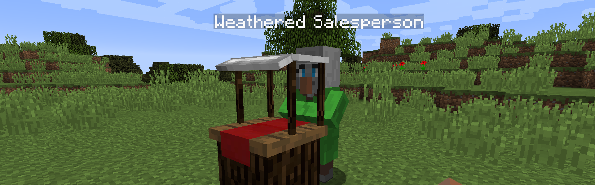

# Farming for Blockheads
{.center}
## Description
???+ Quote "Curseforge Description"

    === " "
        ``` markdown
        This mod adds a Market block to Minecraft, allowing you to buy seeds, saplings or other things such as bone meal. It also adds some farming utilties such as a Chicken Nest, a Feeding Trough, and Fertilizers to improve your crops.

        The market allows searching and scrolling through trades, can filter by category, and is configurable to add further trades and categories to it.
        ```
 CurseForge: [Farming for Blockheads](https://www.curseforge.com/minecraft/mc-mods/farming-for-blockheads) | Project Wakerife - [GitHub](https://github.com/Pundah) | Project Wakerife - [Discord](https://discord.gg/M4HQTQ9g9f)