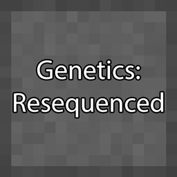

# Genetics: Resequenced
{.center}
## Description
???+ Quote "Curseforge Description"

    === " "
        ``` markdown
        A modern remake of the mod Genetics Reborn (which was itself a remake of Advanced Genetics)!

        With this mod, you can scrape mobs for their Genes, processing them into any of 80+ powers, and infuse them into yourself or others!
        
        Most Genes can be utilized by both players and mobs, so your pets can be as powerful as you are!
        ```

> CurseForge: [Genetics: Resequenced](https://www.curseforge.com/minecraft/mc-mods/genetics-resequenced) | Project Wakerife - [GitHub](https://github.com/Pundah) | Project Wakerife - [Discord](https://discord.gg/M4HQTQ9g9f)