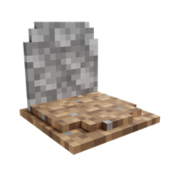

# GraveStone Mod
{.center}
## Description
???+ Quote "Curseforge Description"

    === " "
        ``` markdown
        Every time you die, a grave is placed at your position. To retrieve your items just break the grave. There is also a config option to get your items back by sneaking on the grave (1.16.3+ only).
        ```

> CurseForge: [GraveStone Mod](https://www.curseforge.com/minecraft/mc-mods/gravestone-mod) | Project Wakerife - [GitHub](https://github.com/Pundah) | Project Wakerife - [Discord](https://discord.gg/M4HQTQ9g9f)