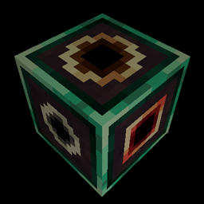

# Hyperbox
{.center}
## Description
???+ Quote "Curseforge Description"

    === " "
        ``` markdown
        The Hyperbox block acts as a portal to another dimension. Each hyperbox has its own dimension stored within; should the block be mined and placed somewhere else, the dimension will remain linked to that block.
        ```


> CurseForge: [Hyperbox](https://www.curseforge.com/minecraft/mc-mods/hyperbox) | Project Wakerife - [GitHub](https://github.com/Pundah) | Project Wakerife - [Discord](https://discord.gg/M4HQTQ9g9f)