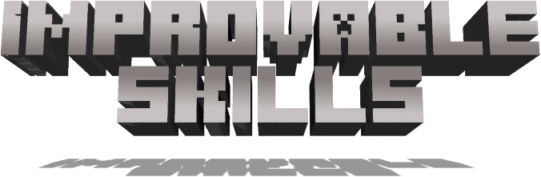

# Improvable Skills 3
{.center}
{.center}
## Description
???+ Quote "Curseforge Description"

    === " "
        ``` markdown
        This is a complete re-write of old PlayerStats and PlayerStats 2 by Zeitheron and xMrVizzy, but using new HammerLib.

        This mod allows players to upgrade themselves using experience and  Book of Skills.
        ```

> CurseForge: [Improvable Skills 3](https://www.curseforge.com/minecraft/mc-mods/improvable-skills) | Project Wakerife - [GitHub](https://github.com/Pundah) | Project Wakerife - [Discord](https://discord.gg/M4HQTQ9g9f)