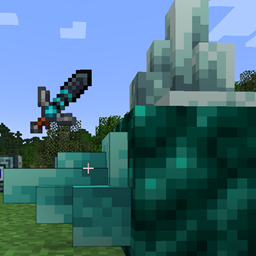

# Just Dire Things
{.center}
## Description
???+ Quote "Curseforge Description"

    === " "
        ``` markdown
        Just Dire Things started as a collection of random items and blocks I wanted added to the game.  Then things kind of got away from me.....

        This mod adds:
        4 Tiers of Resources, requiring exploration of the different Minecraft Dimensions to unlock.
        4 Tiers of Tools, each with unique abilities, some never before seen!
        4 Tiers of Armor, each with their own set of Unique Abilities!
        Many blocks designed around automation.  Including:
        Block Breakers/Placers
        Sensors
        Teleporters
        Energy Generator and distribution blocks.
        ```


> CurseForge: [Just Dire Things](https://www.curseforge.com/minecraft/mc-mods/just-dire-things) | Project Wakerife - [GitHub](https://github.com/Pundah) | Project Wakerife - [Discord](https://discord.gg/M4HQTQ9g9f)