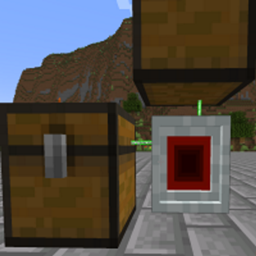

# LaserIO
{.center}
## Description
???+ Quote "Curseforge Description"

    === " "
        ``` markdown
        It started out as a completely different mod, but once I saw how many people wanted to see 'EnderIO Pipes' brought back - the plans got changed and LaserIO was born. 

        LaserIO seeks to replicate the mechanics of EnderIO - allowing you to interact with items, fluids, energy, and redstone -- all from the same block face! Furthermore, 9 separate configurations can be placed per block face, leading to nearly limitless potential for logistics around transportation of resources. 

        This mod has a built in Patchouli book to get you started, and teach you the ways of LaserIO!
        ```


> CurseForge: [LaserIO](https://www.curseforge.com/minecraft/mc-mods/laserio) | Project Wakerife - [GitHub](https://github.com/Pundah) | Project Wakerife - [Discord](https://discord.gg/M4HQTQ9g9f)