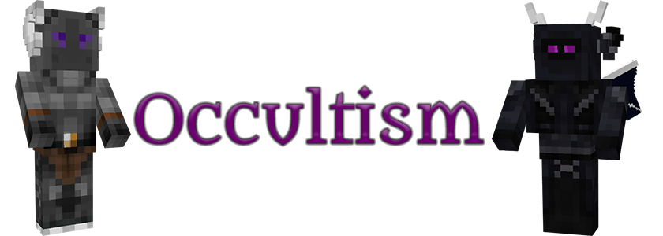

# Occultism
{.center}
## Description
???+ Quote "Curseforge Description"

    === " "
        ``` markdown
        Magicians are widely known as powerful wielders of magic.
        In truth, however, they rely on summoned spirit slaves, known as demons, who perform magic on their behalf.

        This mod is inspired by the world of Jonathan Stroud's Bartimaeus. If you haven't read the books, do that now!
        With the help of occult rituals you will summon spirits, also known as demons, from "The Other Place" to aid you in your adventures.  
        ```


> CurseForge: [Occultism](https://www.curseforge.com/minecraft/mc-mods/occultism) | Project Wakerife - [GitHub](https://github.com/Pundah) | Project Wakerife - [Discord](https://discord.gg/M4HQTQ9g9f)