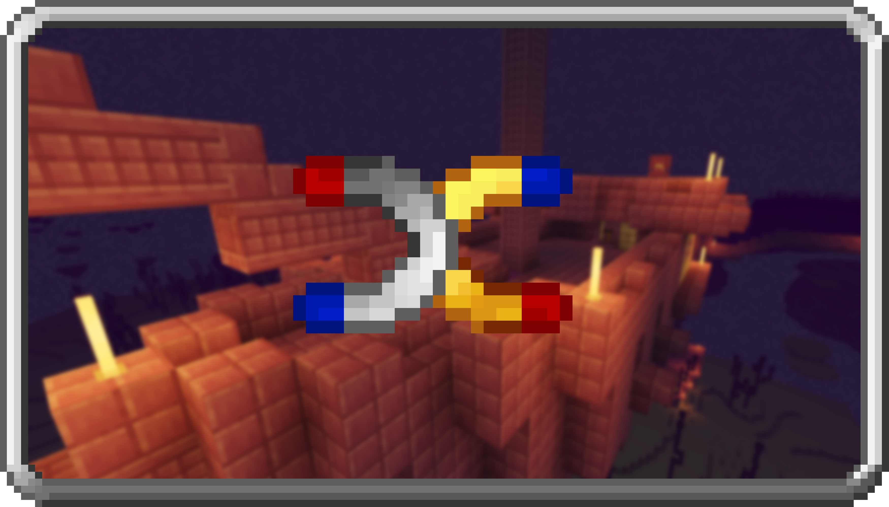

# Simple Magnets
{.center}
## Description
???+ Quote "Curseforge Description"

    === " "
        ``` markdown
        Simple Magnets adds Magnets that pickup Items and Experience around the player! Magnets can be configured with a whitelist or blacklist and have up to an 11 blocks range! Magnets can also be used in Baubles or Curios slots! Magnets can also be toggled with a key bind
        ```


> CurseForge: [Simple Magnets](https://www.curseforge.com/minecraft/mc-mods/simple-magnets) | Project Wakerife - [GitHub](https://github.com/Pundah) | Project Wakerife - [Discord](https://discord.gg/M4HQTQ9g9f)