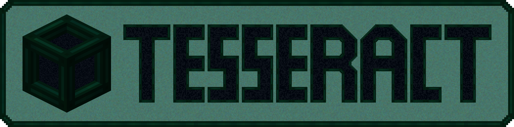

# Tesseract
{.center}
## Description
???+ Quote "Curseforge Description"

    === " "
        ``` markdown
        Tesseract allows you to transport Items, Fluid and Energy. Tesseracts work at any distance and even across dimensions! Use multiple channels to have different groups of Tesseracts!
        ```


> CurseForge: [Tesseract](https://www.curseforge.com/minecraft/mc-mods/tesseract) | Project Wakerife - [GitHub](https://github.com/Pundah) | Project Wakerife - [Discord](https://discord.gg/M4HQTQ9g9f)