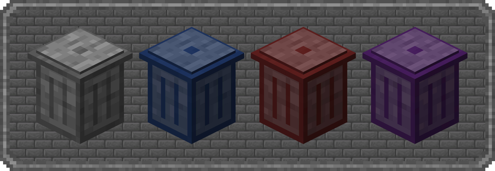

# Trash Cans
{.center}
## Description
???+ Quote "Curseforge Description"

    === " "
        ``` markdown
        Trash Cans adds Trash Cans which can be used to void items, fluids and energy! Items and Fluids can be whitelisted or blacklisted and an energy transfer limit can be set!
        ```


> CurseForge: [Trash Cans](https://www.curseforge.com/minecraft/mc-mods/trash-cans) | Project Wakerife - [GitHub](https://github.com/Pundah) | Project Wakerife - [Discord](https://discord.gg/M4HQTQ9g9f)