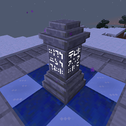

# Waystones
{.center}
## Description
???+ Quote "Curseforge Description"

    === " "
        ``` markdown
        This mod adds waystone blocks that the player can return to once they've been activated, either through a Warp Scroll, a rechargeable Warp Stone, or by using an existing waystone to hop from one to the other.

        It can be used in Survival Mode, for Adventure Maps or on Multiplayer Servers as an alternative to /warp and /home commands. Waystones can be made globally available for all players and a configurable inventory button can be set up to allow warping without any additional items.
        ```

> CurseForge: [Waystones](https://www.curseforge.com/minecraft/mc-mods/waystones) | Project Wakerife - [GitHub](https://github.com/Pundah) | Project Wakerife - [Discord](https://discord.gg/M4HQTQ9g9f)