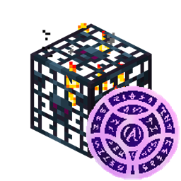

# Apothic Spawners
{.center}
## Description
???+ Quote "Curseforge Description"

    === " "
        ``` markdown
        Apothic Spawners, the Spawner Module of Apotheosis, is a mod that allows you to modify Mob Spawners with various vanilla items. Through modification, you can create faster and more efficient spawners than ever before!
        ```
## Mob Spawners

Mob Spawners can be picked up with silk touch, and have a variety of stats that control their behavior. Breaking a spawner without silk touch will drop a **Broken Spawner** from **EnderIO**.

!!! Info "Behavior control"

    === "Vanilla Stats"

        ``` markdown
        * Minimum Spawn Delay - The lower bound (in ticks) of the time between spawns.
        * Maximum Spawn Delay - The upper bound (in ticks) of the time between spawns.
        * Spawn Count - The upper bound on the number of entities spawned.
        * Max Nearby Entities - The max number of entities (of the spawning type) that can be nearby before spawning stops.
        * Required Player Range - The radius (in blocks) that a player must be within for the spawner to be active.
        * Spawn Range - The radius (in blocks) that the spawner will attempt to spawn entities.
        ```
    === "Apotheosis Stats"

        ``` markdown
        * Initial Health - The amount of max health (in percentage) that mobs will be spawned with.
        * Ignore Players - If the spawner ignores the required player range and activates regardless.
        * Ignore Conditions - If the spawner ignores all spawn rules for the spawned entity.
        * Redstone Control - If the spawner must be activated by a redstone signal.
        * Ignore Light - If the spawner will spawn the target entity regardless of light level.
        * No AI - If spawned mobs have the No AI flag set. They will still be moved by gravity and external force.
        * Silent - If spawned mobs have the Silent flag set. They will make no sound.
        * Youthful - If possible, spawned mobs will be babies.
        * Burning - Mobs will be spawned on fire.
        * Echoing - Spawned mobs will drop an additional copy of their loot table on death.
        ```
## Spawner Modifiers
To adjust the stats of a spawner, you must use a Spawner Modifier. These are recipes that accept one or two input items (held in your hands), that when right-clicking a spawner will apply the indicated stat change.  Spawner modifiers have individual caps on the stats they modify, and can modify more than one stat at once.

Hovering over the modified stats will show a description of the stat, and the modifier-specific min or max value.
## Capturing
The spawner module also adds the Capturing enchantment. This enchantment applies to swords, and gives mobs a chance to drop their spawn egg on death.  Spawn eggs can be used to change the type of mob a spawner will spawn.
> CurseForge: [Apothic Spawners](https://www.curseforge.com/minecraft/mc-mods/apothic-spawners)